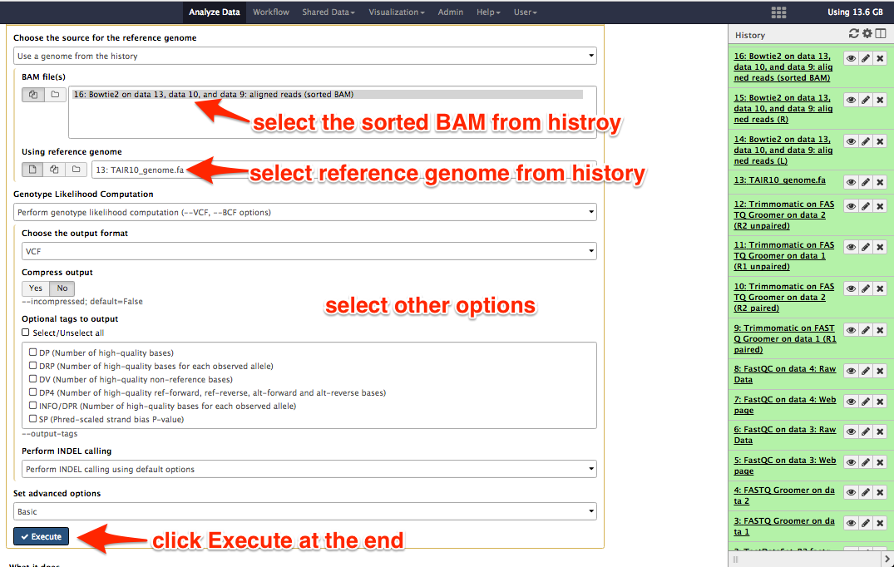
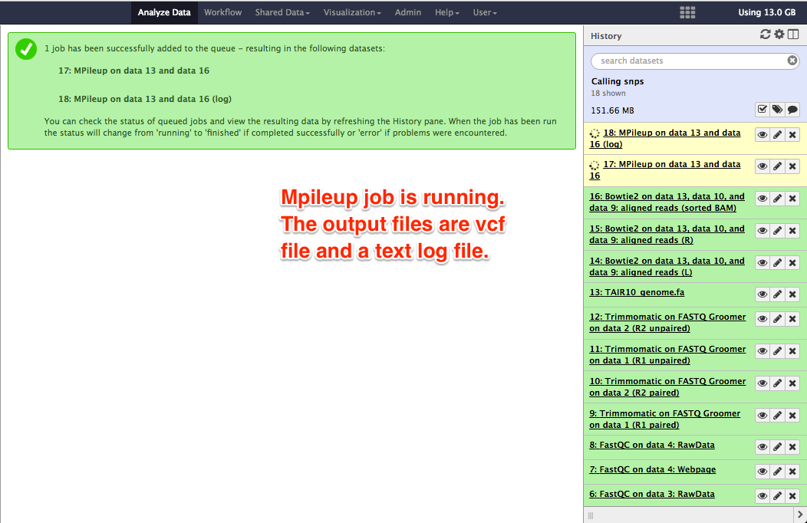
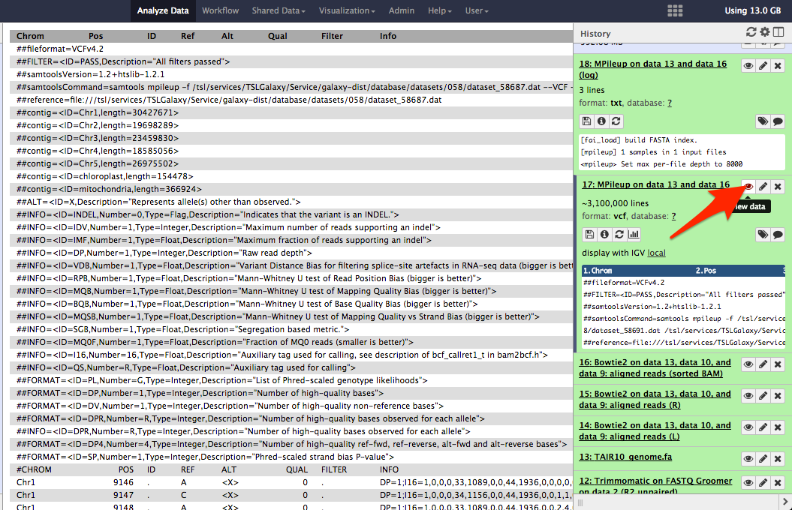
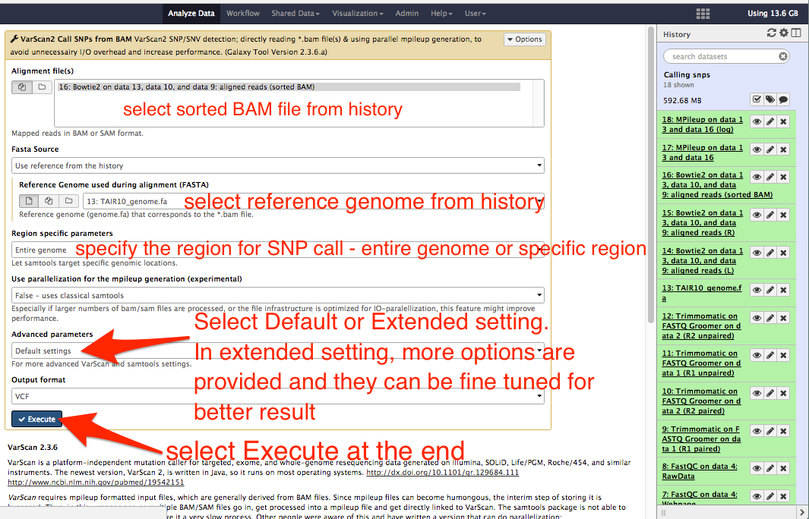
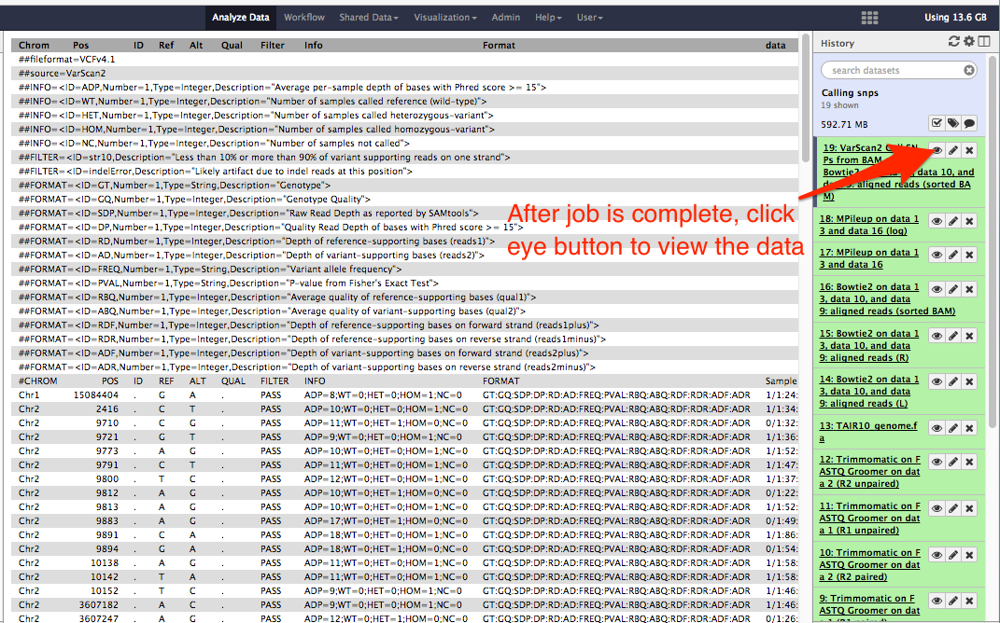
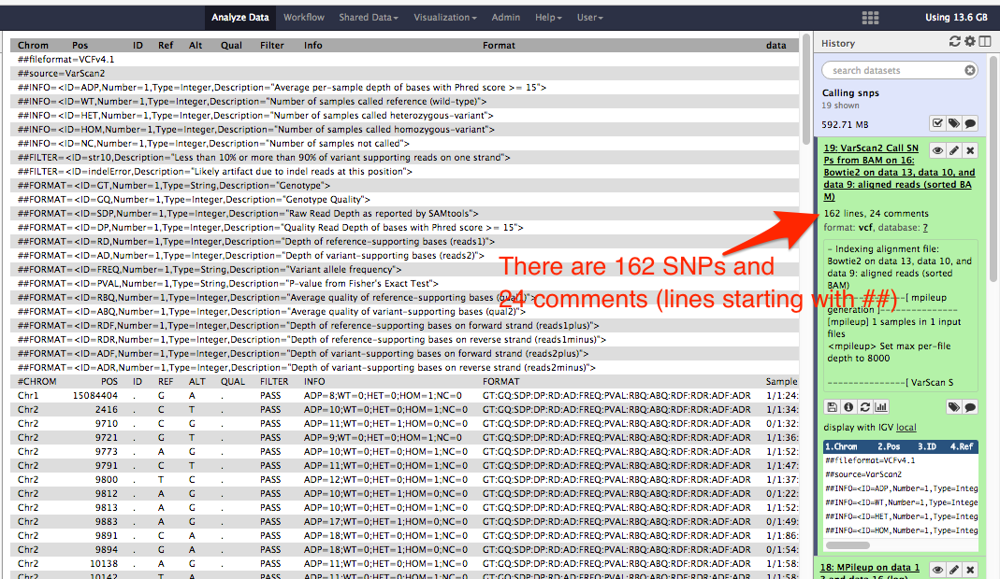

# SNP Call

## About this chapter

### Questions
* What are SNPs?
* How to call SNPs?

### Objective
* Calling SNPs using alignment file and reference sequence

## What are SNPs?

SNPs stands for Single Nucleotide Polymorphisms. SNPs are the genetic variation in the genes that are generally stable in the population. For more information on SNPs, visit the weblink: https://ghr.nlm.nih.gov/primer/genomicresearch/snp

## How to call SNPs?

SNPs can be called after mapping the reads to a reference sequence and generating SAM/BAM file.

In galaxy, you can use __mpileup__ followed by __varscan__ tool to call SNPs.

From the tool panel, choose __Mpileup__ version 2.1.1 under __NGS: SAM Tools__ and then select the BAM file as your input. See the figures below.

After the mpileup job is complete, it produces a VCF file and a log file. The VCF file contains nucleotide base call from your input data at all positions in a reference sequence. Check the column __POS__ that increases by 1 in every row. You will need to filter out the SNPs only from this file.

Choose __varscan__ version 0.1 and choose the mpileup output VCF file as input. See figure below:

