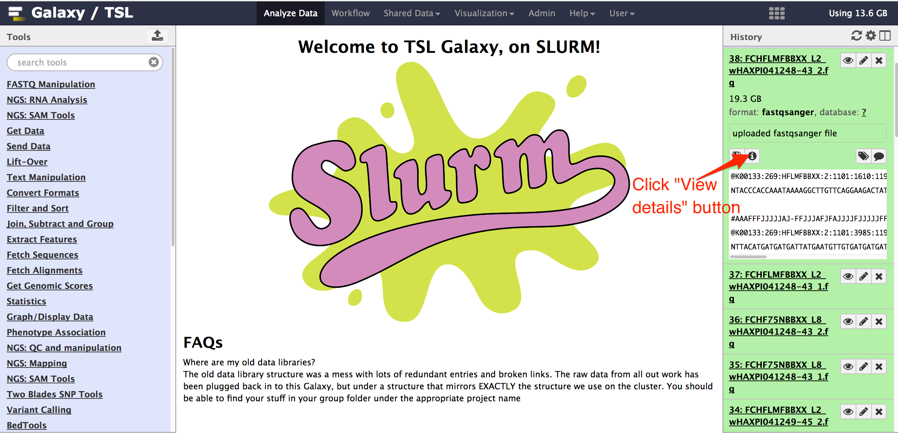
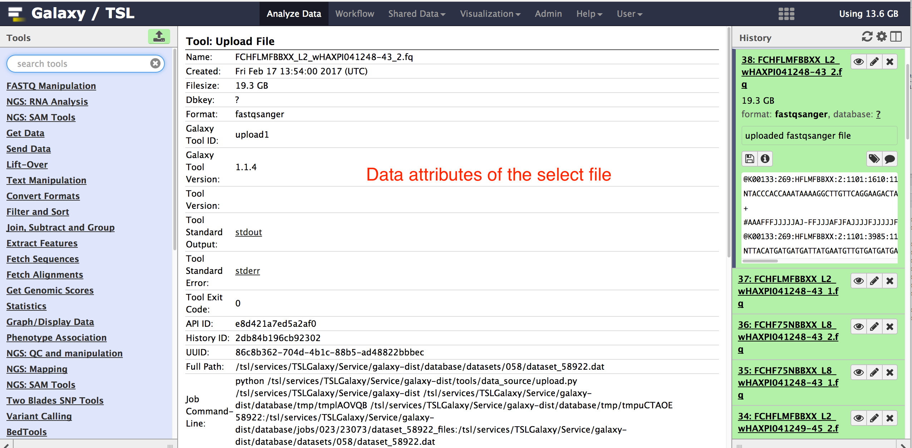
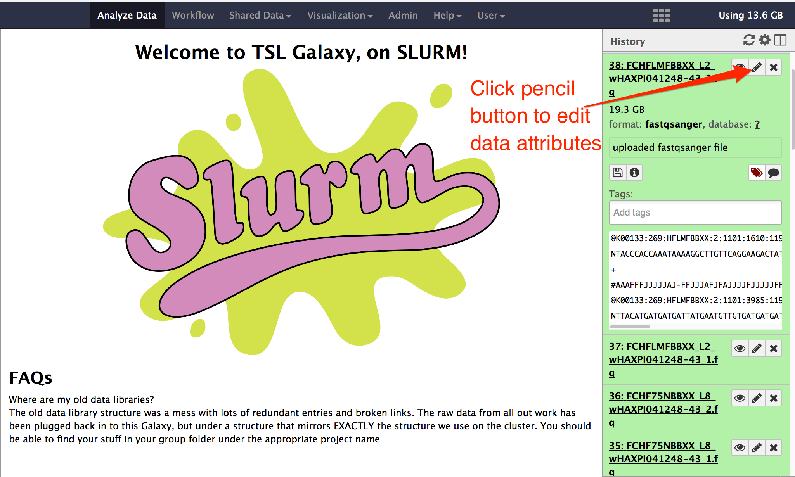
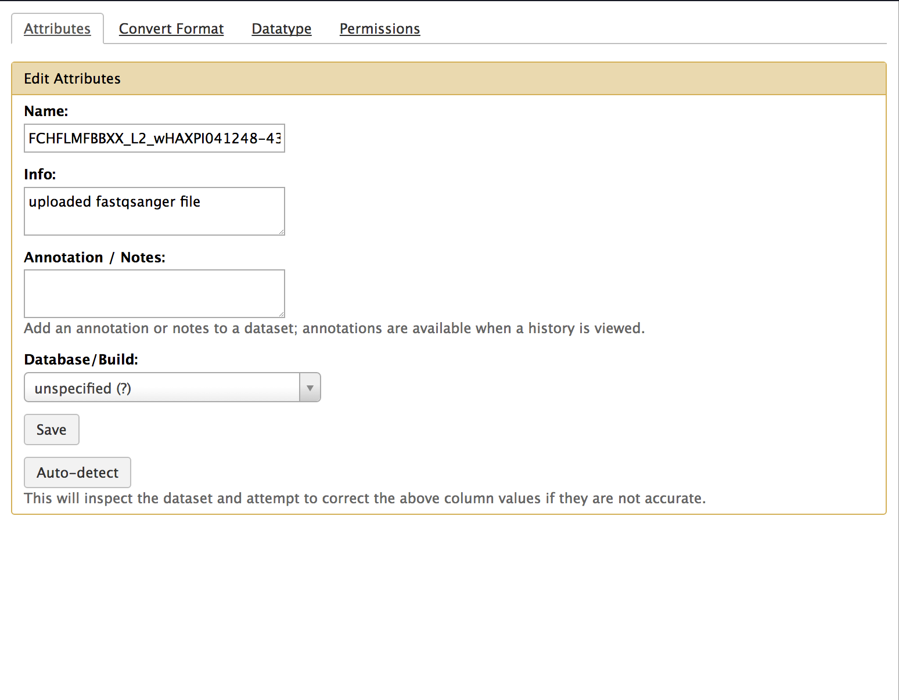
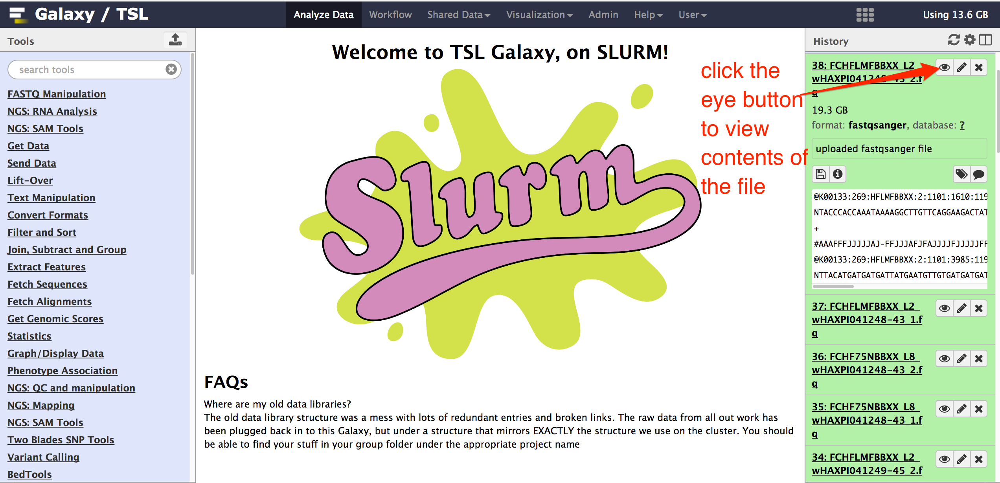
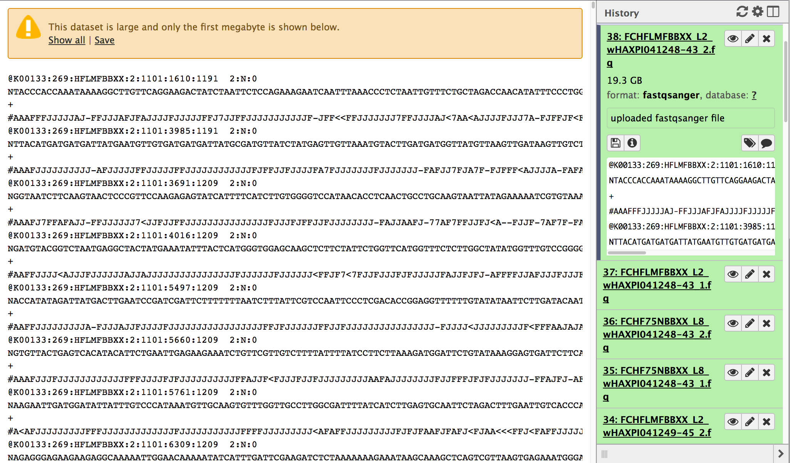
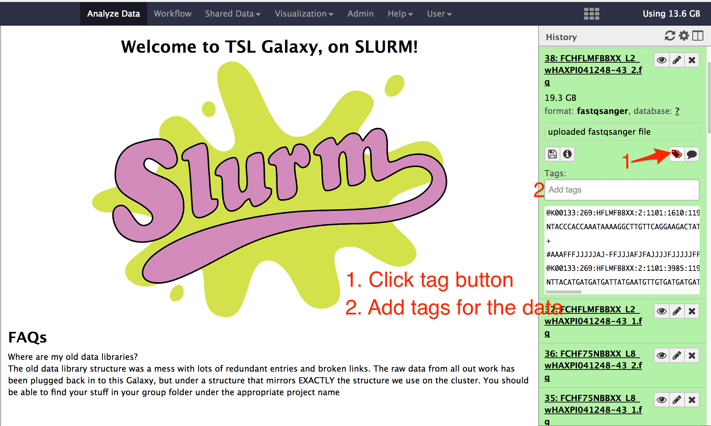
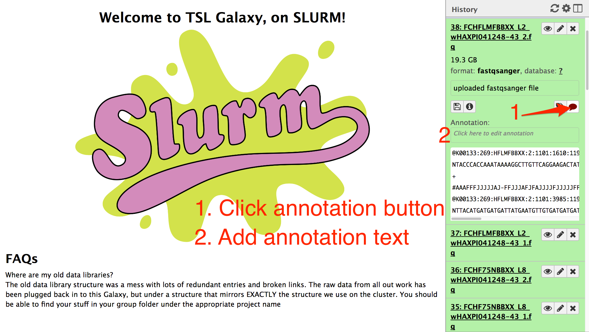
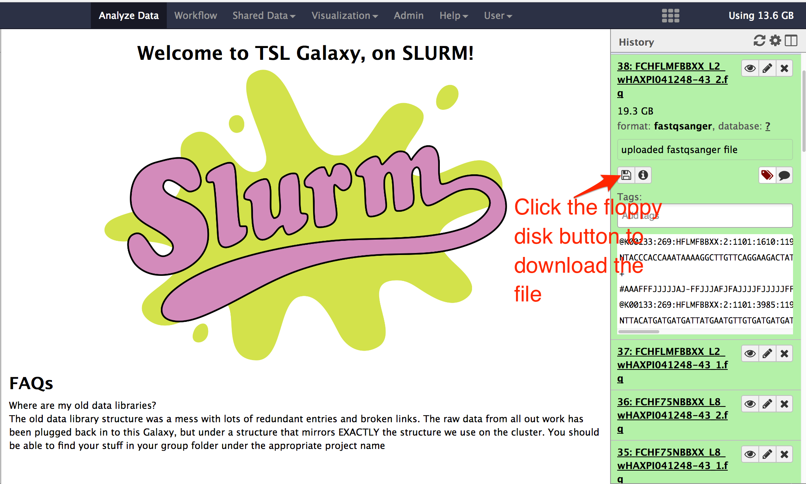

# Data Attributes

## About this chapter

### Questions

  * What are data attributes?
  * How to view data attributes?
  * How to edit data attributes?
  
### Objectives

  * To know and view the data attributes
  * To edit the data attributes

## Data attributes

Data attributes are the extra information about the data. Information like data file format, annotations/tags about the data, database linked to the data, access permission on the data etc.

## View data attributes

Click on a data filename in the history. The field of the data will expand down in the history. Click on the small bold __i__ like  __view details__ button. The details of the data file will be shown in the central area.

## Edit data attributes

Click on __edit attributes__ button. In the central area of galaxy web interface, the fields with data attributes will appear. You can change __Attributes__, __Convert Format__, __Datatype__ and __Permissions__ for the data.  Make necessary changes and then save the changes.

## View data file contents

click on the eye button next to the filename in history to view the contents of the file. If the file is huge in size, only the first 1 MB of the data will be displayed.

## Add/Edit data tags

Click on the __edit tag__ button. A new __Tag__ field will appear. Type some keywords related to the file to help you to identify the data in the future. When you are done, click again __edit tag__ button. The keywords are saved automatically.

When you have many files in the history or many saved data files, you can search the data file using these keywords/tags.

## Add annotation

click on the __Add Annotation__ button. A new field __Annotation__ will appear. Type some description about the data that will help you to identity the data in the future.

## Download data file

Click a __download__ button to download the data file.

