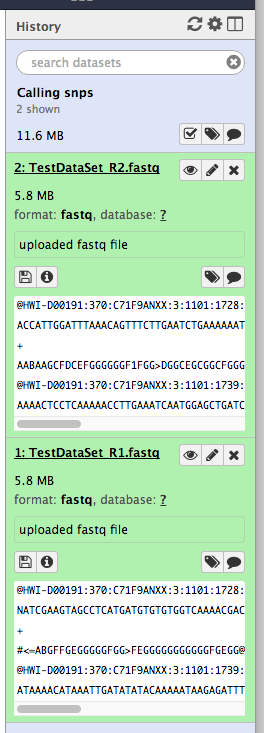
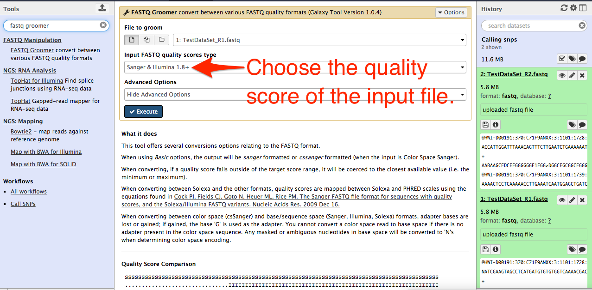
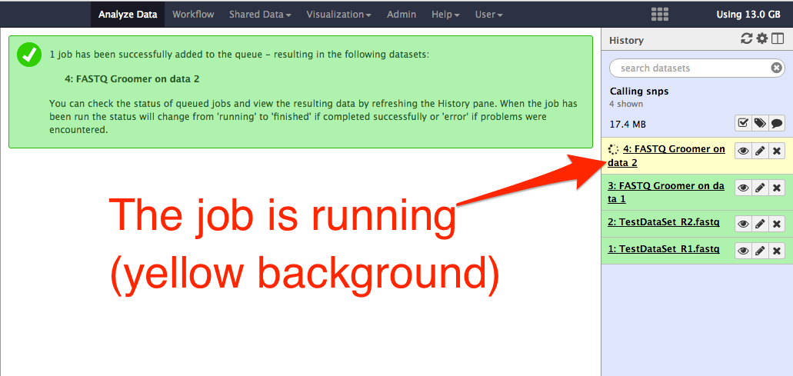

# FASTQ Grooming

## About this chapter

### Questions

  * What is fastq grooming?
  * Why fastq grooming may be required?

### Objects

  * convert file format using fastq grooming
  * understand necessity of fastq grooming

## FASTQ grooming

FASTQ grooming means converting quality score of nucleotide bases to a different format. Galaxy tools require fastq quality scores in sanger (ascii offset of 33) format. Illumina sequencing pipeline encoding quality score in illumina 1.3 to 1.7 have different quality encoding. Galaxy tools cannot find these files after uploading them. Therefore, they need to be groomed to sanger format before analysing. Check this video on fastq data grooming (https://vimeo.com/76024253).

All sequencing platforms now produce sanger format quality score. You can choose datatype as "fastqsanger" while uploading raw datasets from new sequencing platforms.

Note: Although a fastq dataset has sanger format quality scores, while uploading the data, if you choose the datatype as fastq, the dataset may not be available for further processing. But if you choose, datatype as fastqsanger, they are available to downstream tools for further processing.

Here I show how to do FASTQ grooming.

A new history __Calling snps__ is started. Two fastq files are uploaded as datatype __fastq__. See figure below:

