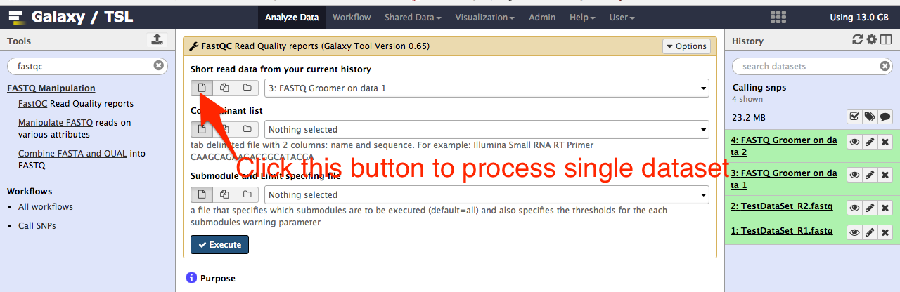
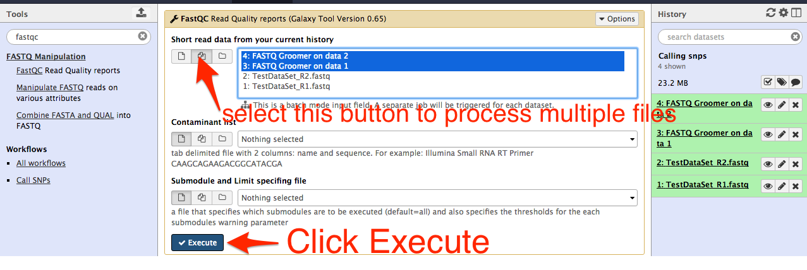
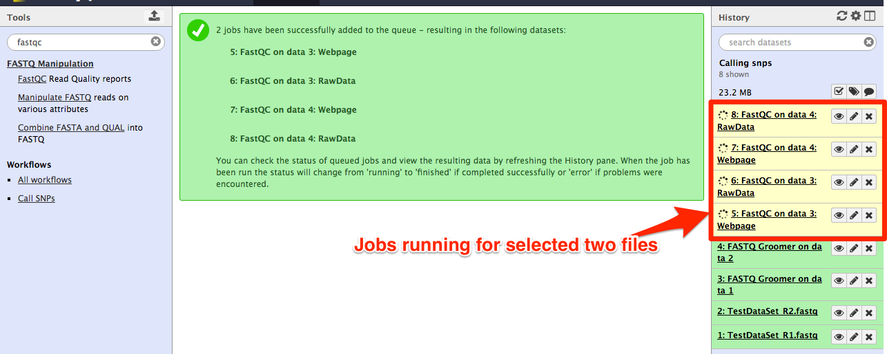
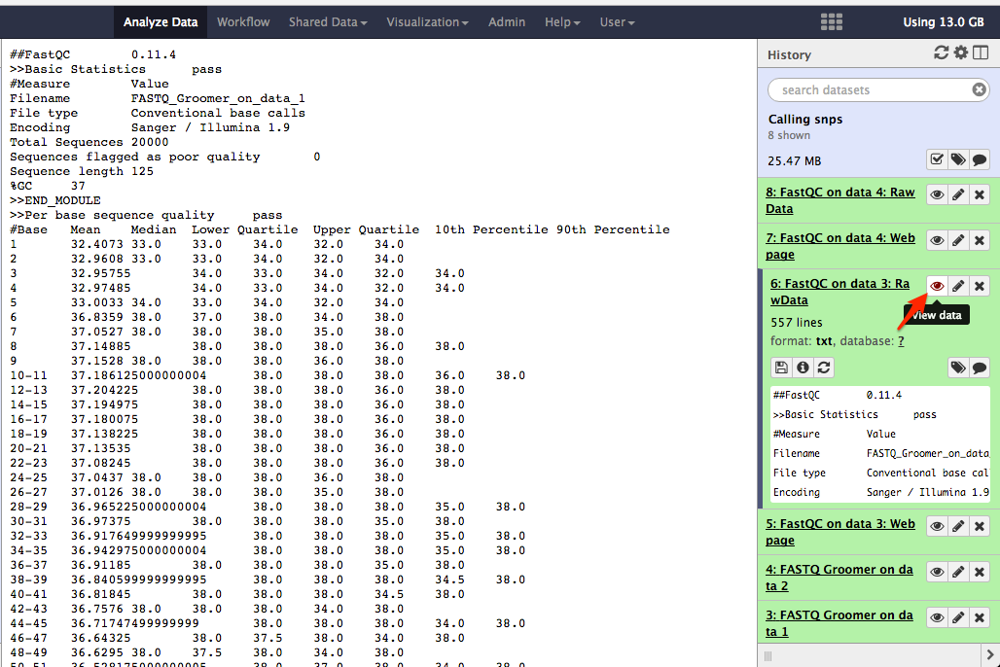
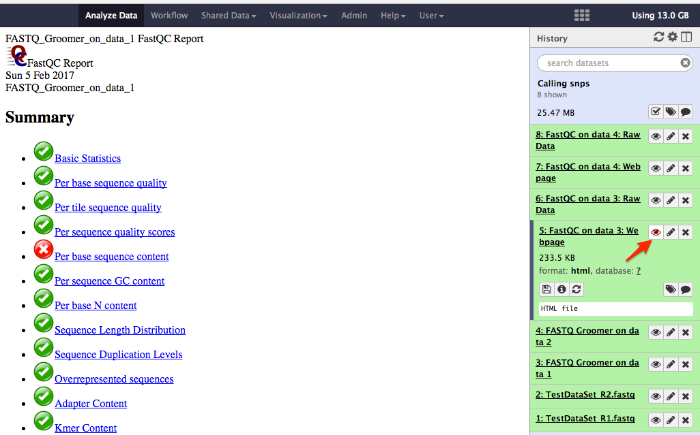

# FASTQC

## About this chapter

### Questions
  * What is FASTQC?
  * Why is FASTQ data quality check required?
  * How to do FASTQ data quality control?

### Objectives
  * Know data quality
  * Necessity of FASTQ data quality control
  * Learn to do FASTQ data qualtiy control

## FASTQ data quality

Modern sequencing platforms like Illumina, 454, Pacific Biosciences etc sequences short fragments of DNA by adding a template base complementary nucleotides to an existing short oligonucleotide. Sequencing platforms record the nucleotide adding in the form of light intensities and based on that the integrated algorithms returns the best nucleotides being added along with a numerical score called __phred score__ converted into __ASCII__ value. The sensitivity of the sequencing platforms does not remain same throughout the sequencing process and so the nucleotide base call by the algorithms goes on decreasing. User can check the confidence of seqeunce data by looking at the quality score of each nucleotide in the sequence.

An example of FASTQ data looks like this:

@SEQ_ID

GATTTGGGGTTCAAAGCAGTATCGATCAAATAGTAAATCCATTTGTTCAACTCACAGTTT

\+

!''*((((***+))%%%++)(%%%%).1***-+*''))**55CCF>>>>>>CCCCCCC65

For more information on FASTQ data quality, check these sites

https://en.wikipedia.org/wiki/FASTQ_format

https://support.illumina.com/help/BaseSpace_OLH_009008/Content/Source/Informatics/BS/QualityScoreEncoding_swBS.htm

http://www.phrap.com/phred/

## Why do we need data quality control?

As every base call in the sequence data has no confidence of being corrected, those low quality data need to trimmed out to have a high quality and confident result. Usually the base quality goes on decreasing form left hand side to right hand side of the sequences. You can set a confident threshold quality score and trim the sequences from right to left hand side. The remaining data now has high quality data only.

## How can we do data quality check?

A widely used tool for fastq data quality check is FASTQC. For more information on the tool, check this weblink: (http://www.bioinformatics.babraham.ac.uk/projects/fastqc/)

## How to use FASTQC tool?

In the tool panel, search __FASTQC__ and then select it. The FASTQC tool options will appear in the central area. Select a one or multiple data files and click __execute__ button.

The jobs start executing as shown with yellow background in the history. See figure below:

When the jobs are completed, user can click __view data__ to check the fastq quality check results of the data files.

Note: Check both output files (Rawdata, webpage) for each input data file as shown below.

The links in the result page are works. User can click on the links to navigate to different sections of the result. Try to click __Kmer Content__ link when you view webpage result.

