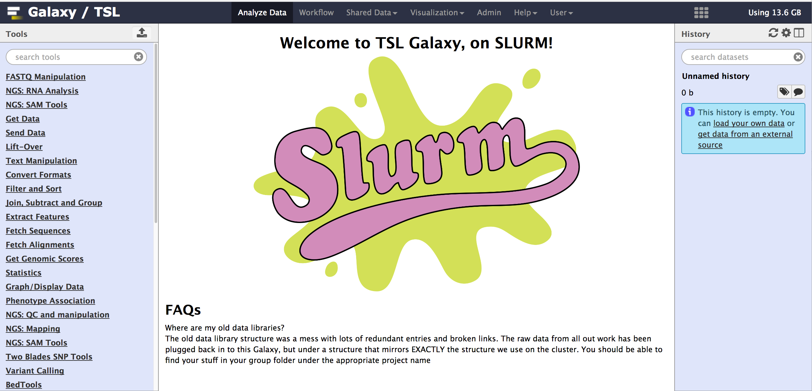
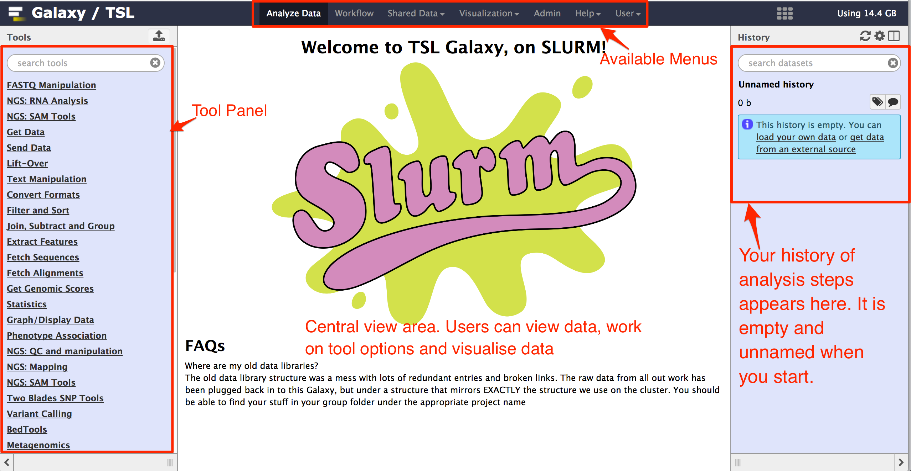

#Galaxy web interface

## About this chapter

  1) Questions
    * How does Galaxy web interface look?
    * What does Galaxy web interface contain?
  
  2) Objective
    
    * Become familiar with Galaxy web interaface
  

## Galaxy Web Interface

After successful login, you will see a galaxy web interface. An example of a galaxy web interface is shown below:

There are three sections in the galaxy web interface.

  * The left column contains links to the downloading, preparation and analysis tools.
  * The center column is where the menus and data will appear.
  * The right hand column shows the history of analysis steps, allows to view data and results, and more (see figure below).
  
Following figure shows different layouts of galaxy web interface.

