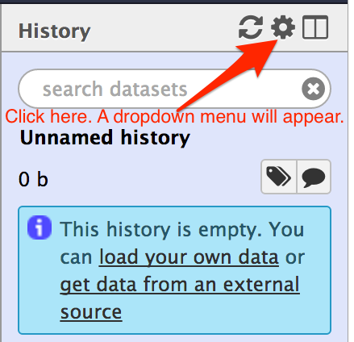
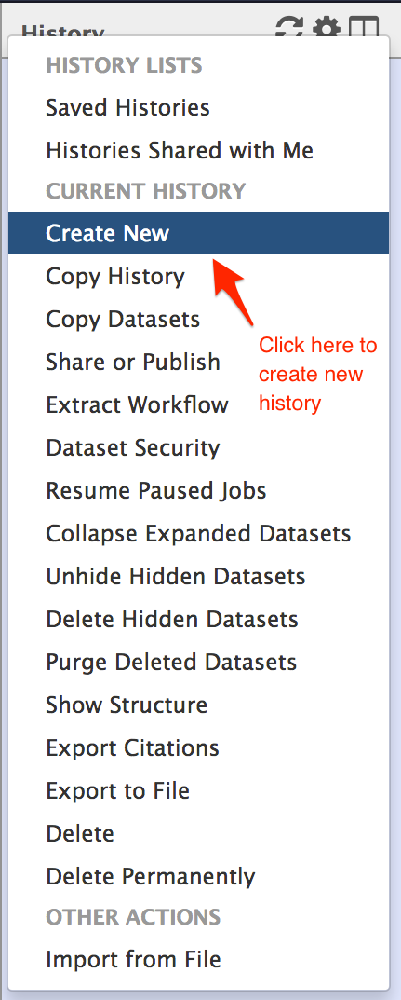

#Getting started

## About this chapter

1) Questions
  
  * How to get started?
  * What is a history?

2) Objectives

  * Create a new history
  * To rename a history

## What is a History?

A history is a systematic record of your data analysis steps. Galaxy provides a numerical record of every analysis step you do starting from 1. The uploaded file or an output file from a tool are all numerically recorded in a history.

## Create a new history

When a user logins for the first time, the user has no any history. Let's create a new history. To create a new history, follow the figures below:

A new history is created. By default, the history name is __unnamed history__. Double click on the __unnamee history__ and type in the name of the analysis you want it to be. It is wise to name the history by the type of the project and analysis you are doing e.g. __RNAseq_snpcalling__.

