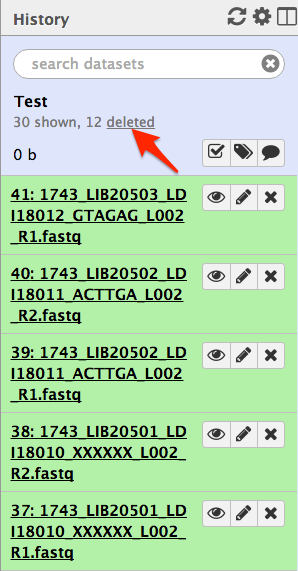
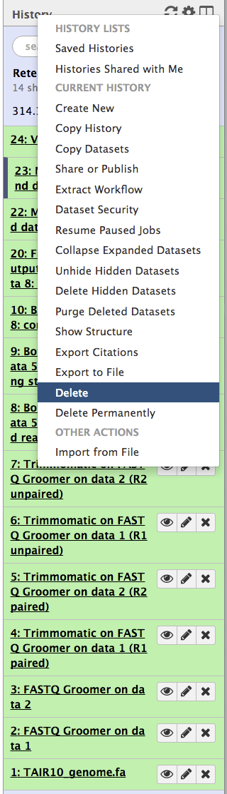
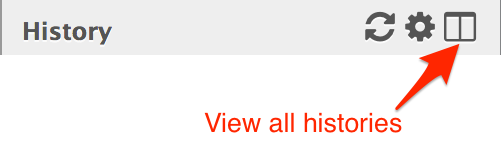
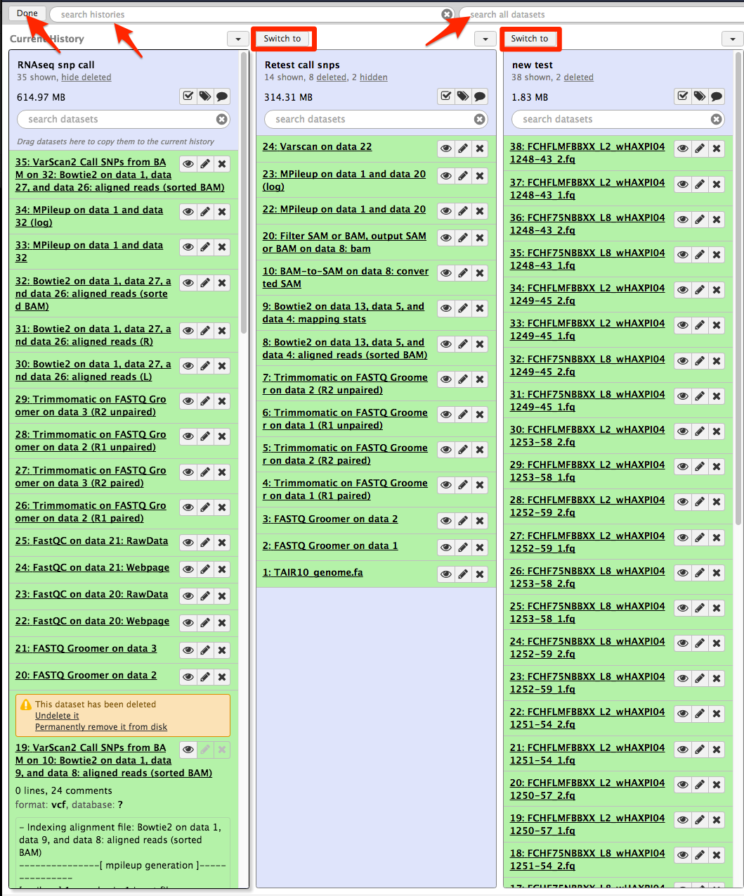
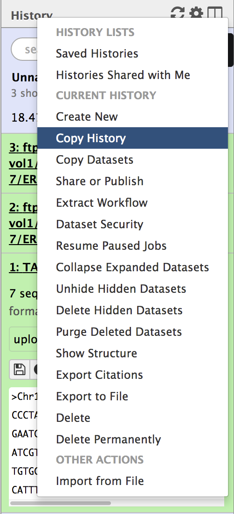
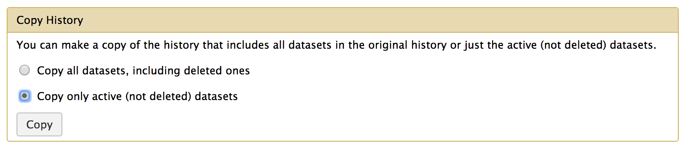
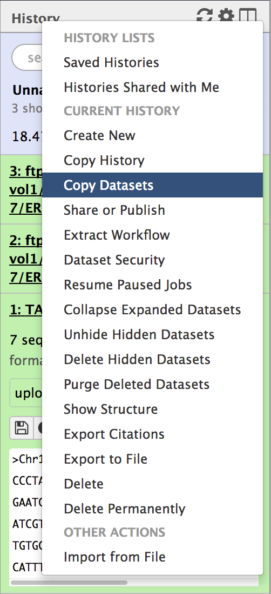
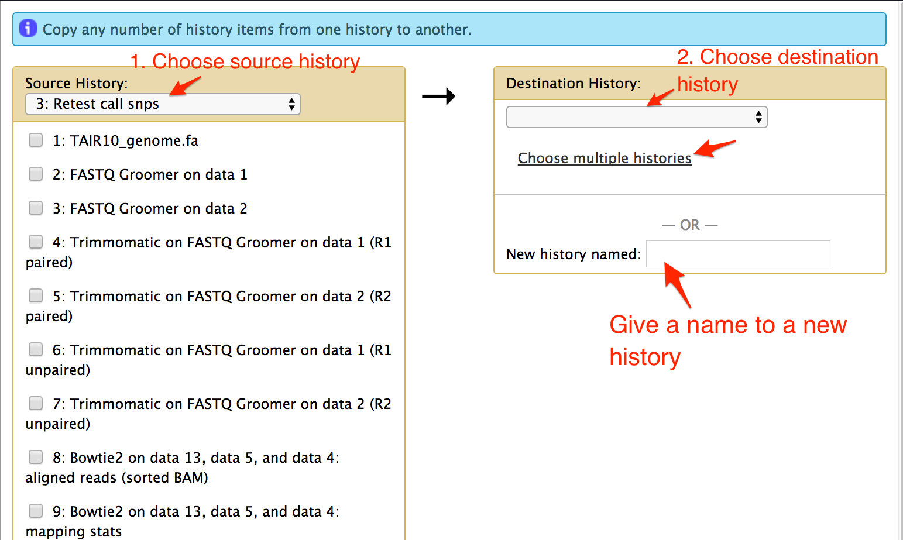

# History Management

## About this chapter

### Questions
* How many histories can I create?
* How can I delete history?
* Why do I need to delete history?
* Switch between history

### Objective
* delete analysis step/s and/or history
* switch between histories

## How many histories can I create?

You can create as many histories as you want. We covered creating a new history in chapter 3.3. When you have many histories, use history names that will help you to distinguish between the histories.

## Delete files from history

Output files from an analysis tool can be deleted in the current history. click a little cross icon to the right of the filename to delete the file in the current history. The filename disappears from your history. The number of deleted files is shown below the history name. See figure:

Click on the __deleted__ word under history name (as shown in figure above) to see the deleted files in the current history. Each section of deleted filename will have pink background with links to __undelete it__ or __Permanently remove it from disk__. We advice to delete the file permanently if you think you don't need the file forever.

## Delete a history

Deleting your history will delete your all data and analysis results with it. To delete your current history, click __History Options__ and select __delete__. See figure

However, deleting your history will not delete permanently from galaxy. You will be able to retrieve it in the future if you need it. In this way, the used disk space in the galaxy go on increasing and cause disk management issue in the future. We advice you to delete them permanently if you no longer use them. To delete the history permanently, select __Delete Permanently__ in the __History Options__.

## Switch between histories

To switch to a different history, click __view all histories__ at the top of the history. See figure

This will display all your histories in columns. You can scroll to the left to view all your histories, if they all do not fit in the display.

Every column with a history has a button __Switch to__. Select the __Switch to__button__ on your desired history and click __Done__ at the top left corner of the display and then you are in that history. There are two search fields __search histories__ and __search all datasets__ at the top for you to search your history by its name and by any dataset name respectively in the history as well.

## Copy History

You can make a copy of a current history and then switch to the new hisotry to continue more analysis. Click __History Options__ and select __Copy History__ option. It will then asks you if you want to copy of the current history that includes all datasets in the original history or just the active (not deleted) datasets. See figures below:

Choose an option and click __copy__. 

## Copy Datasets

Click __History Options__ and select __Copy Datasets__. A form for copying the data from one history to another is displayed at the center. At the left of the form, select the history with the data you want to copy and then select one or more datasets. At the right of the form, select a history from drop down or click __choose multiple histories__ to copy data to more than one history. You can also copy the datasets to a new history. See figures below:

