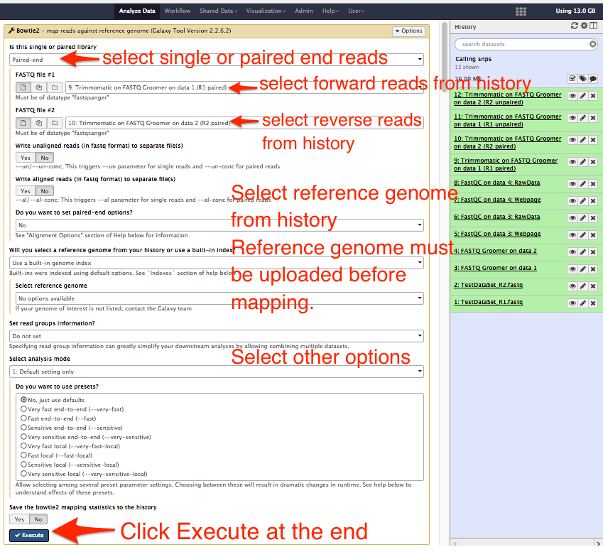
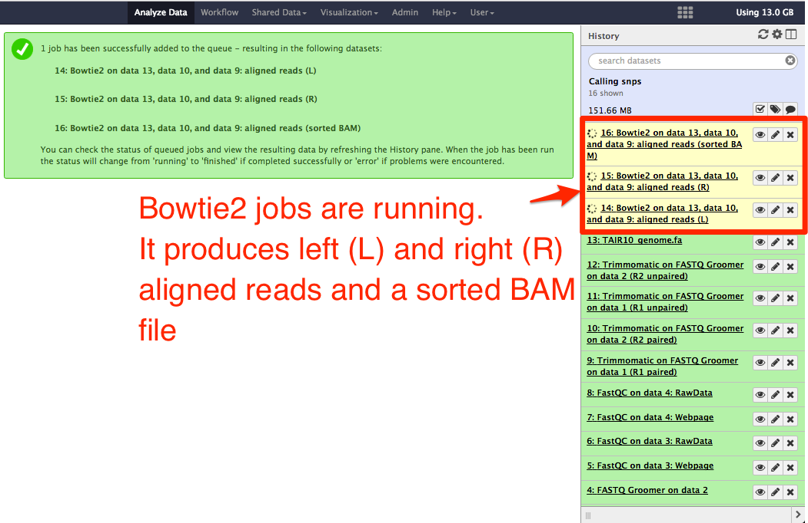
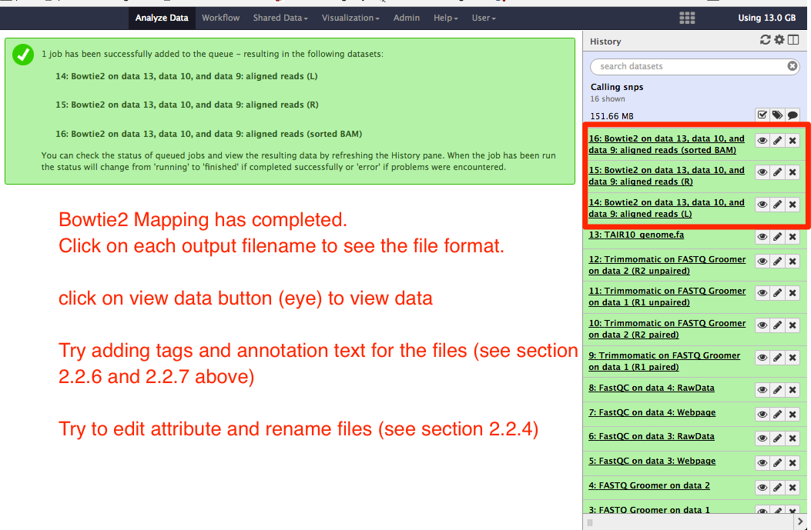

# Mapping reads to a reference sequence

## About this chapter

### Questions
  * What is reads mapping?
  * Why is reads mapping necessary?
  * How to do reads mapping?

### Objectives
  * To know reads mapping
  * To learn mapping the reads to reference sequence

## What is sequence reads mapping?

Sequence reads mapping is a way of comparing how identical or different is your generated raw reads from the standard known reference sequence or the assembled sequence. Nucleotide bases insertion, deletion or substitution are common differences you see in your raw data with the reference sequence. For more information on sequence reads mapping, check the links https://en.wikipedia.org/wiki/Sequence_alignment, https://www.ncbi.nlm.nih.gov/pmc/articles/PMC2705234/

## How to do reads mapping in galaxy?

Reads mapping can be done using reads alignment softwares installed in the galaxy. In the tool panel, there is a section "NGS: Mapping", under which are the next generation reads mapping tools like __Bowtie2__ and __BWA__. We will use bowtie here to demostrate reads mapping.

Select __Bowtie2__ under NGS:mapping. The options for __Bowtie2__ appear in the central area of the galaxy webinterface as shown below:

You will need to select forward and reverse reads filename if your data is paired-end or select one file with reads if your data is single end. You will need to select your reference genome is built-in genome index and it is in history. If it is not available, select the reference genome fasta file. Either built-in genome index or the reference genome fasta has to be available in the history to select. The rest of the options may be left as default and click __execute__ at the end.

The jobs start running as shown in the figure below:

Depending on the size of the input files, reads mapping may take long time. After the job is completed, the output filename background color changes to green as shown below:

Note: Depending upon the mapping tool selected, the number of output filenames may differ. Bowtie2 produces a BAM format alignment file. Some alignment tools produce SAM format file.
We will talk about SAM and BAM files in the next chapter.

