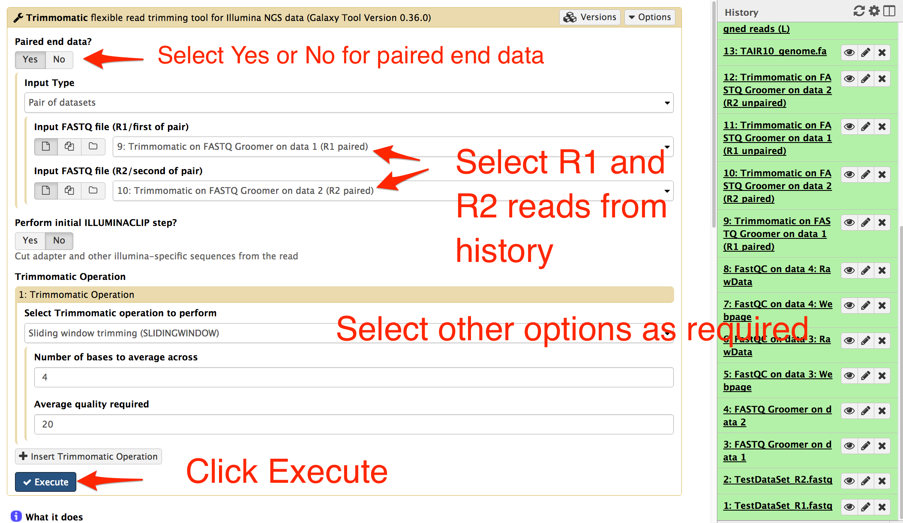

# Quality Trimming

## About the chapter

### Questions
  * What is quality trimming?
  * Why is quality trimming required?
  * What are the tools available for quality trimming?

### Objectives
  * To know quality trimming
  * Learn quality trimming using available tools
  
## Quality Trimming

Quality trimming means cleaning the raw sequence data, removing the poor quality nucleotide bases from the sequence reads.  As mentioned in the __FASTQ data quality__ section in the previous chapter, raw data sequences have poor quality nucleotides incorporated and these poor quality bases might compromise the final result. Quality trimming ensures only the high quality data is considered for downstream analysis processes.

## Quality trimming tools

There are many quality trimming tools available online. Following tools are installed in TSL galaxy:
  * Sickle
  * trimmomatic
  * seqtk trimfq
  * FASTQ quality trimmer
  * FASTQ trimmer

Trimmomatic is widely used quality trimmomatic tool and we will use the tools for the purpose of this handbook.

## How to use Trimmomatic tool

Select trimmomatic tool from the tool panel on the right. In the central area, the options for trimmomatic tools will appear as shown below:

Select __Yes__ or __No__ for paired end data based on your data. Select your input FASTQ files from the history. Input other options and then select __execute__ at the end.

Check your history on the right side of the galaxy webinterface. If the job are waiting to be executed, the filenames will appear in grey background. If the jobs are running, the background color is yellow and if the jobs have completed, the background color is green.

Note: Depending upon the quality trimming tool selected, the number of output filenames may differ.
