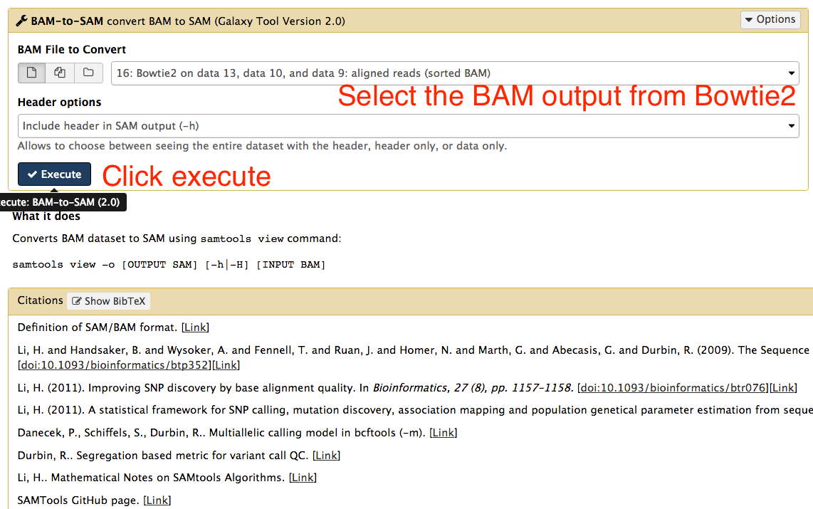

# SAMools

## About this chapter

### Questions
  * What are SAMtools?
  * What are SAM and BAM?
  * Are SAM and BAM convertible?

### Objectives
  * Understand SAM and BAM formats
  * Convert SAM to BAM and vice versa
  * Using SAMtools in galaxy
  * Filter mapped reads in the alignment

## SAMtools

SAM Tools provide various utilities for manipulating alignments in the SAM format, including filtering, sorting, merging, indexing and generating alignments in a per-position format. For more information on SAMtools, visit the weblink: http://www.htslib.org/doc/samtools.html

## SAM and BAM formats
SAM and BAM are the file formats for recording the sequence alignments. SAM stands for Sequence Alignment/Mapping and BAM is for Binary version of SAM format. For more information about the SAM format file, check this weblink: https://samtools.github.io/hts-specs/SAMv1.pdf

SAM and BAM files are inter-convertible using SAMtools. Check this weblink http://www.htslib.org/doc/samtools.html

## Using SAMtools in galaxy

Search __NGS:SAM Tools__ in tool panel to find __BAM-to-SAM__ tool in the galaxy. Click the tool to display the options in the central area. 

## Filtering aligned reads

Reads aligned in SAM/BAM file formats can be filtered for e.g. the reads are paired, get only the reads mapped between x and y points in a reference sequence, reads mapped to X chromosome in a reference or reads with quality score over 30. To filter the reads in SAM file, choose __Filter SAM or BAM, output SAM or BAM__ tools under __NGS: SAM Tools__ from tool panel and choose the option from drop down to apply the filter.

