# Uploading raw data

## About this Chapter

### Questions

  * How to upload your local data to galaxy?
  * How to upload your data from datahog __(data.tsl.ac.uk)__ to galaxy?
  
### Objectives

  * Uploading local data to galaxy
  * Uploading your data in datahog to galaxy

## Upload local data to galaxy

Users can upload raw data on their local computer drive by any one method as shown in the figures below.

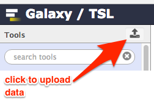 or 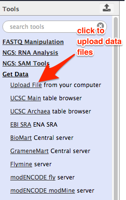

In the next step, Galaxy asks you some the type of the data (e.g. fasta/fastq/fastqsanger/vcf etc). If your data is generated in the modern sequencing platforms, choose fastqsanger as the data type. This will avoid running fastq groomer tool later.

Click on the __Choose local file__ button and then browse the data file to select your data. The selected file will be listed. You can choose more local files by clicking __choose local file__ button. When you are ready to upload, click the __start__ button. Galaxy will start uploading the selected data. 

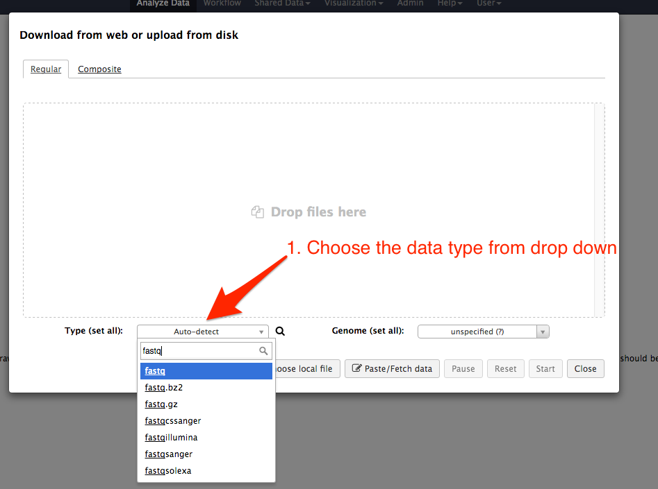

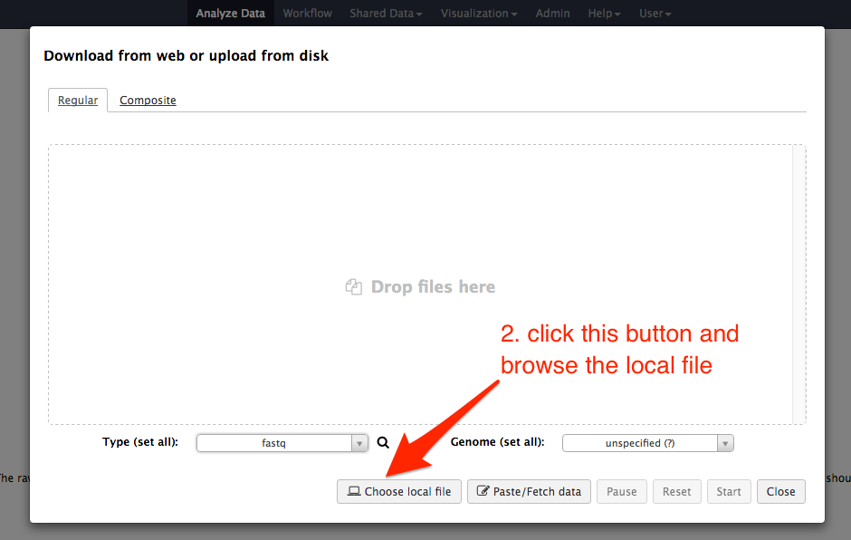

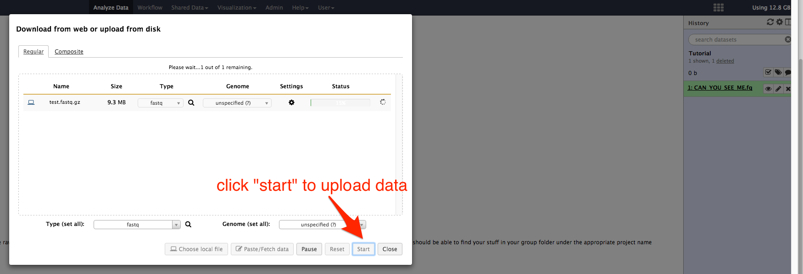

As galaxy start uploading, on the history panel on the right shows the filename. When the job is in pending state, the background color is grey, when it is uploading or processing, the background appears in yellow and after completion it appears in green background.

While the data are in upload process, click on the __close__ button if you wish to close the window box.

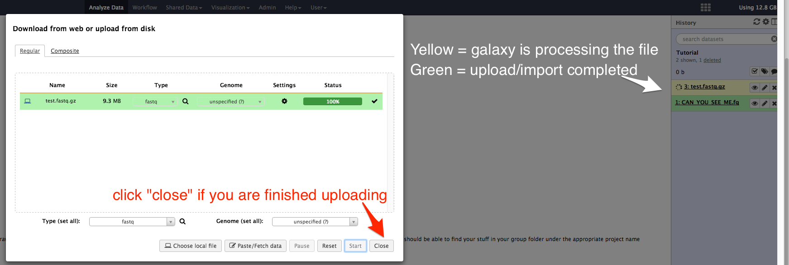

## Upload data from datahog to galaxy

Data generated for TSL projects are stored in TSL datahog ( __data.tsl.ac.uk__ ). You can access the datahog from galaxy. At the horizontal menu list at the top, click on the menu __Shared Data__ and then select __Data Libraries__.

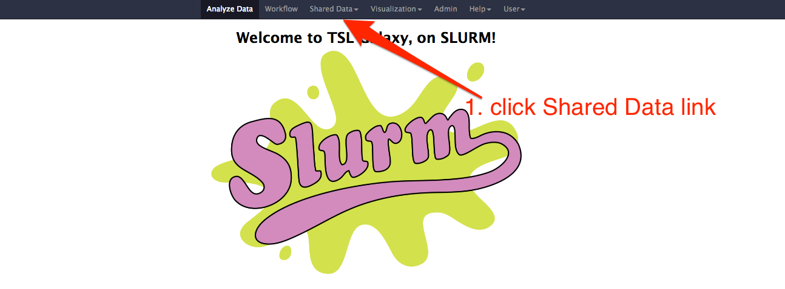

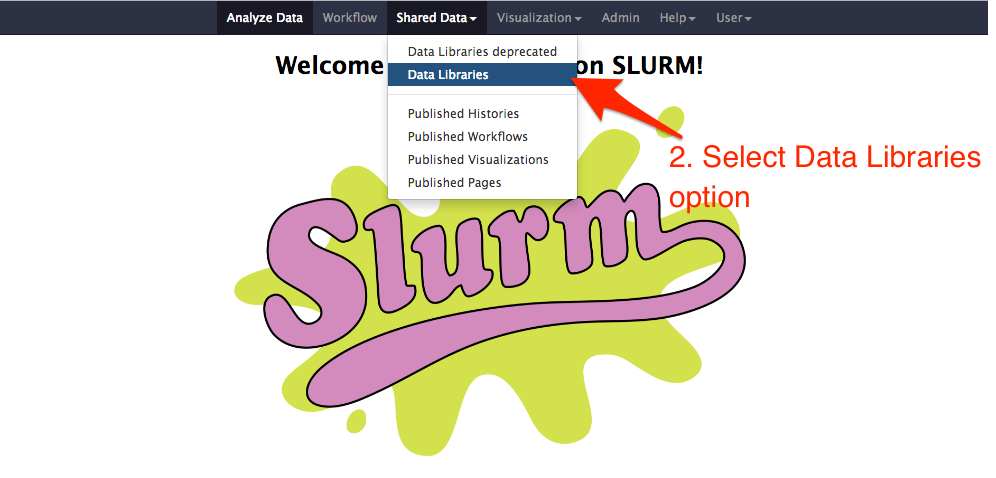

Select __/tsl/data/reads__ and then your group.

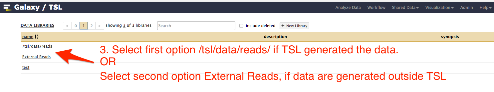

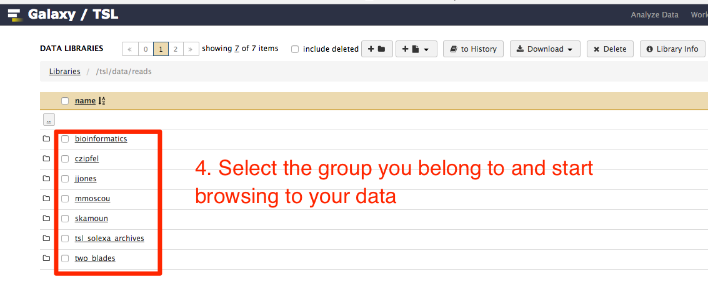

Go on browsing to the file you want and then select it. You can select multiple files as well. If you want to select all files in a folder, just select the folder.

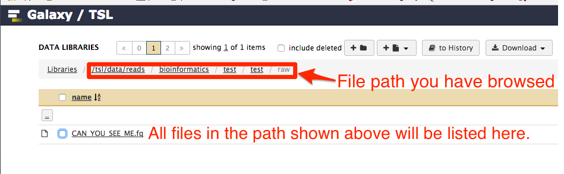

After your seelction, click __to History__ button. Choose your history name. If you have many histories, click the drop down list and select the one you are working on. Then click __import__ button.

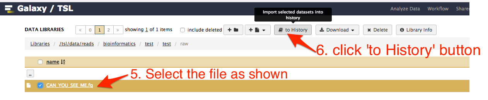

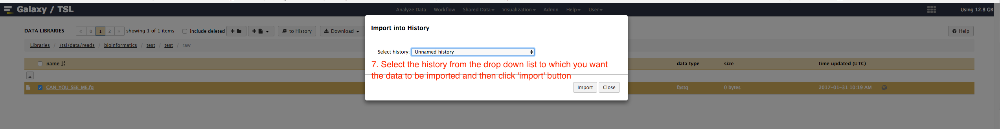

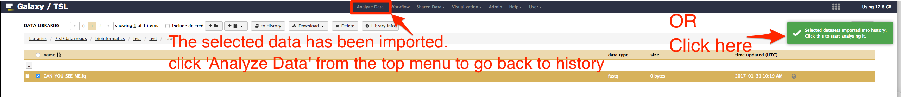

The data file imported is now listed in the history. If the file is huge in size, the process of importing it may take some time and during this time, the background of the filename will be yellow in color. After the importing is completed successfully, the background color will be green.

## Upload data from internet

Data on public database like NCBI and EBI-SRA can also be upload to your galaxy history straightaway. For more information, check this weblink (https://wiki.galaxyproject.org/Support#Get_Data:_Upload)