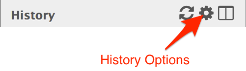
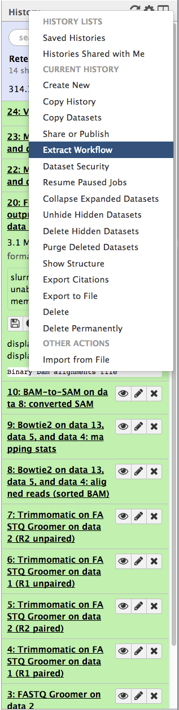
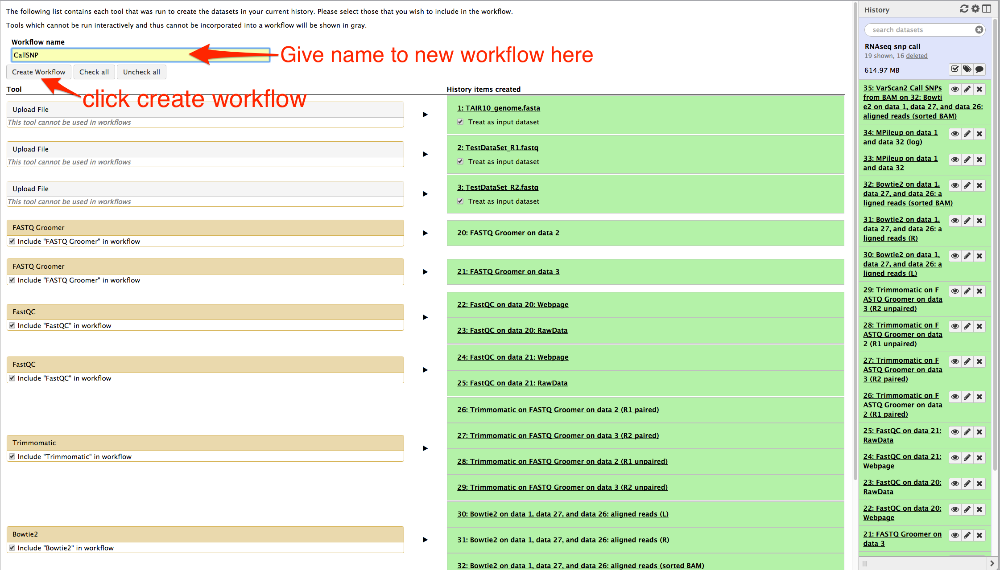
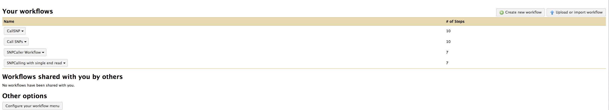
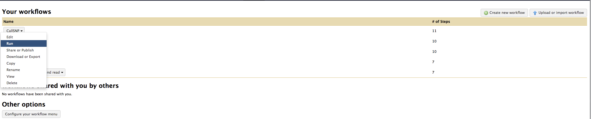
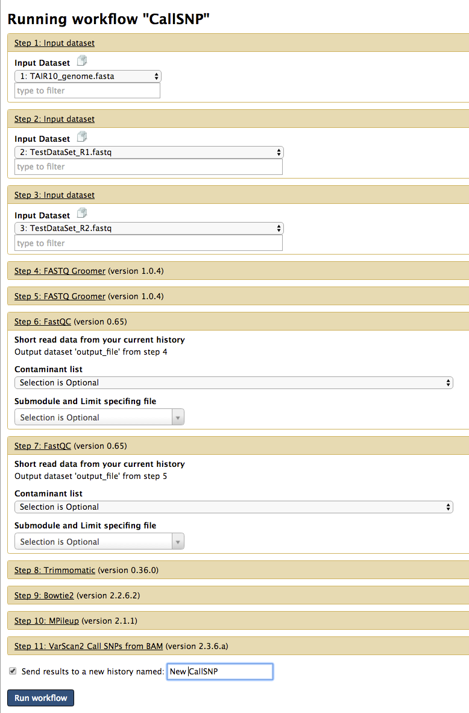
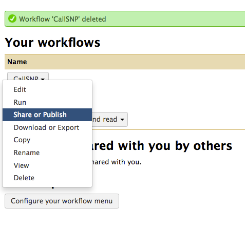
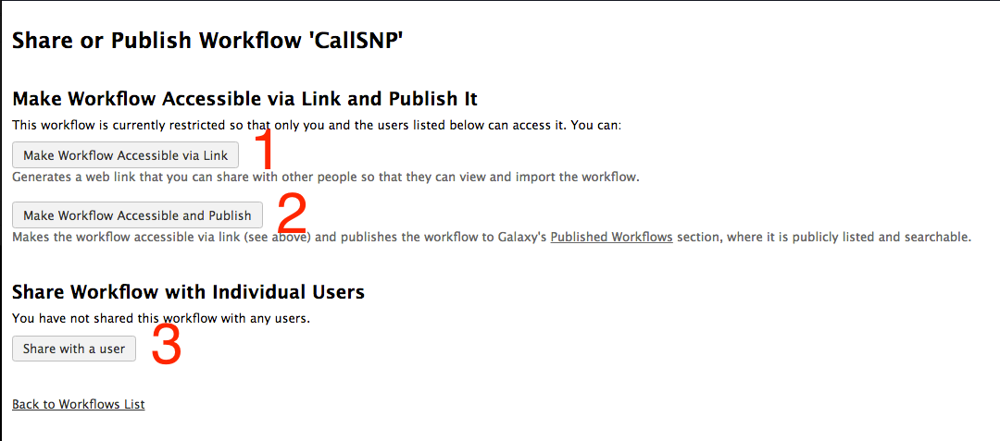
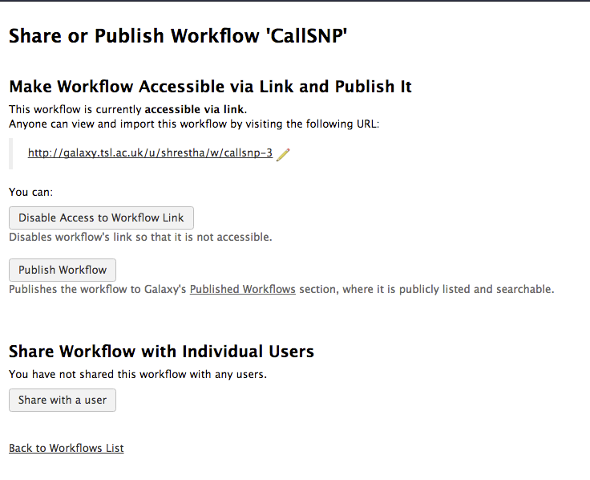

# Create, Run and Share Workflow

## About this chapter

### Questions
* What is a workflow?
* How to create workflow?
* How to run workflow?
* How to share workflow?

### Objectives

* Create workflow from history
* Run the workflow
* Share workflow

## What is a workflow?

A workflow is a series of systematic analysis steps to obtain/accomplish a specific objective. It can also be called as a pipeline. In galaxy, you upload your data and do some analysis with different tools one after another and get the result at the end. This is your workflow for that specific analysis. However, if you need to do similar analysis for a different uploaded file, you will need to follow the same steps one by one. It would be easier to tell galaxy to follow the similar analysis for different files and then sit back and relax to get the result. Yes, you can do that. You will need to create a workflow for your existing history.

## How to create a workflow?

In the existing history, where you have accomplished your analysis and obtained result, click __History Options__ and select __Extract Workflow__. See below:

A new workflow is created, after you click __create workflow__ button.

The new workflow is available in your workflow page. Click the menu __workflow__ at the top of the webinterface. This will display your workflow page with a list of workflows. See figure below:

## Run a workflow

In your workflow page, click on the name of a workflow you want to run. A drop down with list of options is displayed. Select __Run__ options to execute the workflow. You will need to upload your input reference sequence or raw read fastq files before running the workflow as input datasets are not part of workflow by default. See figures below:

Select the input files for your new workflow. The options for individual tools in the workflow can be selected as well. There is an option __Send results to a new history  named:__ at the bottom, which can be selected and give a new history name to save the results in to the new history. Clicl __Run workflow__ to start the workflow.

## Share workflow

In your workflow page, click on the name of a workflow you want to run. A drop down with list of options is displayed. Select __Share or Publish__ option. See figure:

You can share workflow in different ways. 

Option 1 "Make Workflow Accessible via Link" creates a link to the workflow and is diplayed on the same page. You can share the link to any one using the galaxy. See figure:

Option 2 "Publish Workflow" makes the workflow available to any one using the galaxy unless permission is set.

Option 3 "Share with a user" provides you to select a user. You can choose option 3 multiple times to add more users to share.

